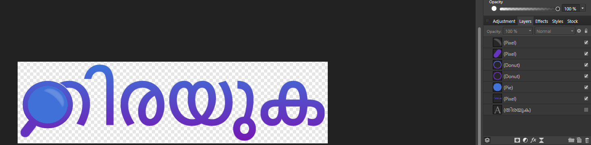

# Malayalam Information Retrieval and Text Classification System

A comprehensive system for searching and classifying Malayalam documents, developed for the CS410 course. This project integrates traditional Information Retrieval (BM25) with modern NLP techniques (DistilBERT) and features a user-friendly web interface.

## Features

- **Web Interface**: A Google-style search interface built with Streamlit.
- **Information Retrieval**: BM25-based document retrieval with keyword highlighting.
- **Text Classification**: 
  - **SVM**: TF-IDF based Support Vector Machine for efficient classification.
  - **DistilBERT**: Fine-tuned Transformer model for high-accuracy "Politics" vs "Other" classification.
- **Data Processing**: Custom tokenizer and stemmer for the Malayalam language.
- **Evaluation**: Automated evaluation scripts for IR metrics (MAP, NDCG) and Classification metrics (F1-Score, Accuracy).

## Project Structure

```
malayalam_ir/
├── data/               # Corpus, processed data, and relevance judgments
├── models/             # Trained models (SVM, BERT) and indices (BM25)
├── results/            # Training checkpoints and logs
├── src/                # Source code
│   ├── app.py          # Streamlit Web Application
│   ├── classify_bert.py# BERT training script
│   ├── retrieval.py    # BM25 implementation
│   ├── preprocess.py   # Malayalam text cleaning and tokenization
│   └── ...
├── requirements.txt    # Python dependencies
└── run_all.bat         # Batch script to run the full pipeline
```

## Installation

1. **Clone the repository**
2. **Create a virtual environment** (recommended):
   ```bash
   python -m venv .venv
   # Windows
   .venv\Scripts\activate
   # Mac/Linux
   source .venv/bin/activate
   ```
3. **Install dependencies**:
   ```bash
   pip install -r requirements.txt
   ```

## Usage

### 1. Run the Web Application (Recommended)
The easiest way to interact with the system is via the web interface.
```bash
streamlit run src/app.py
```
*Note: Ensure you are in the `malayalam_ir` directory.*

### 2. Run the Full Pipeline
To collect data, process it, train models, and evaluate:
```bash
# Windows
run_all.bat
```

### 3. Individual Components

- **Data Collection**: `python src/collect_data.py`
- **Preprocessing**: `python src/preprocess.py`
- **Train SVM**: `python src/classify.py`
- **Train BERT**: `python src/classify_bert.py`
- **Evaluate**: `python src/evaluate.py`

## Implementation Details

### Data Collection & Preprocessing
- **Collection**: Data is collected from Malayalam news sources (or simulated via `collect_data.py`).
- **Preprocessing**: 
  - Text is cleaned to remove non-Malayalam characters (except punctuation).
  - A custom stopword list is applied.
  - A suffix-stripping stemmer reduces words to their root forms (e.g., removing case markers like 'il', 'ude').

### Information Retrieval (BM25)
- Implements the **Okapi BM25** ranking function.
- **Indexing**: An inverted index is built mapping terms to document IDs with term frequencies.
- **Scoring**: Documents are scored based on term frequency (TF) and inverse document frequency (IDF), normalized by document length.
- **Parameters**: $k_1=1.5$, $b=0.75$.

### Text Classification
- **SVM Approach**:
  - Uses **TF-IDF** vectorization (ngram_range=(1,2)) to represent text.
  - A Linear SVM is trained to distinguish between "Politics" and "Other".
- **BERT Approach**:
  - Uses **DistilBERT** (`distilbert-base-multilingual-cased`), a smaller, faster, cheaper version of BERT.
  - Fine-tuned for sequence classification using the Hugging Face `transformers` library.
  - **Oversampling**: To handle class imbalance (few "Politics" articles), the minority class is oversampled in the training set.

## Evaluation Results

- **Retrieval (BM25)**: 
  - **MAP (Mean Average Precision)**: ~0.63
  - **NDCG (Normalized Discounted Cumulative Gain)**: ~0.71
- **Classification (BERT)**: 
  - **F1-Score**: ~0.99 (Politics class)
  - **Accuracy**: >99%

## Team
- **Course**: CS410 Text Information Systems
- **Semester**: Fall 2025
- **Members**: Tom Karingada / tkari2

## Credits
Developed for CS410.

## Fun Fact
I do graphic design on the side, the logo for Thiruka was put together as a side thing in order to take my mind off the code.


